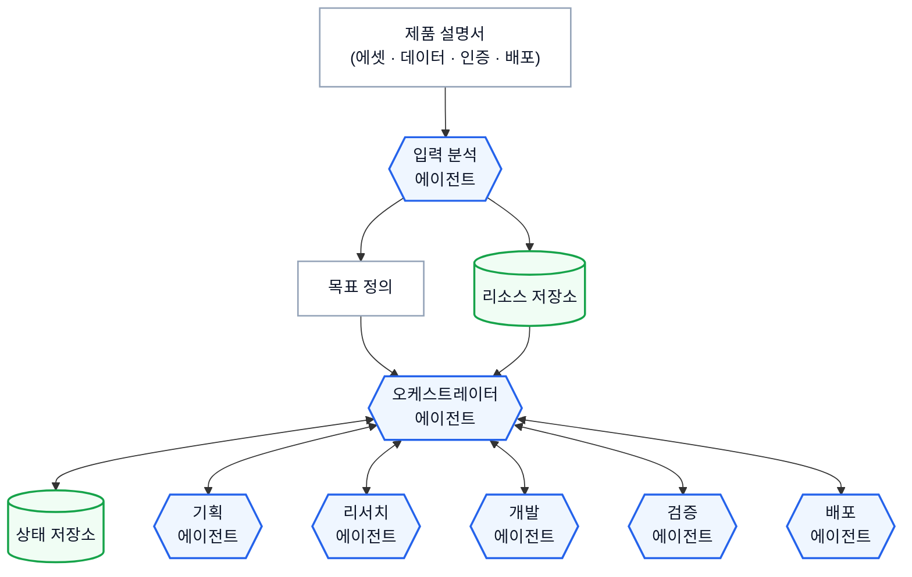
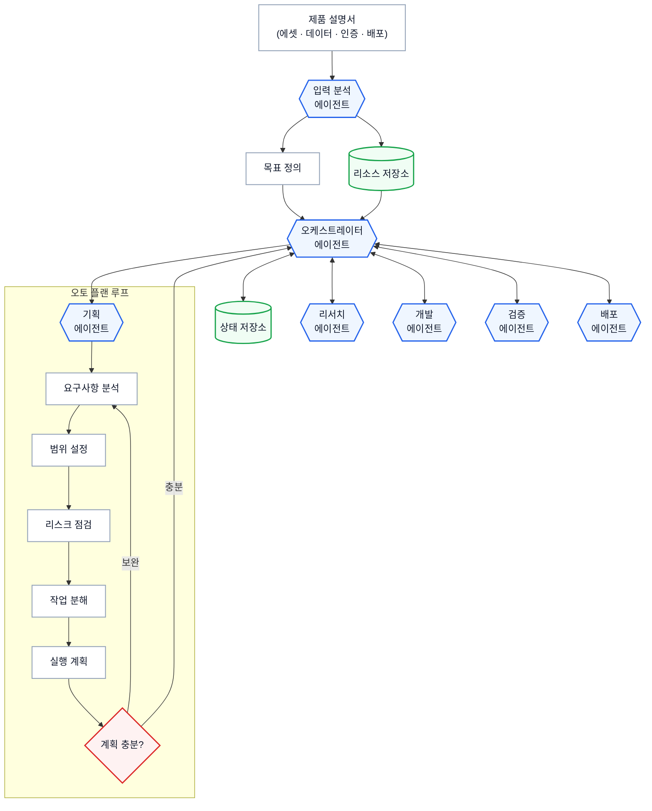
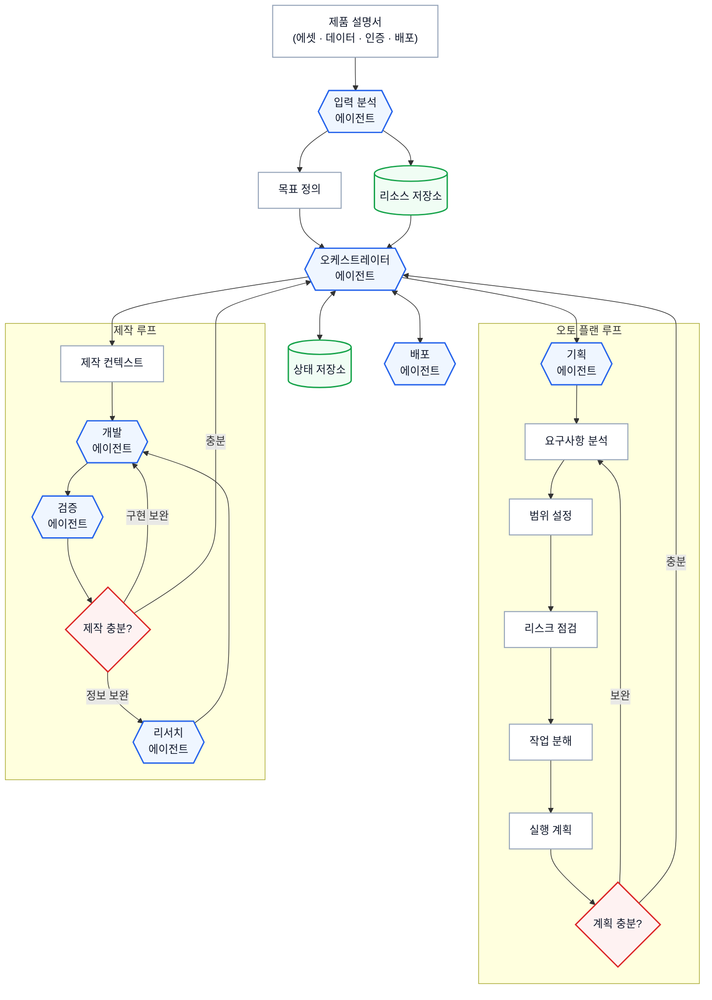
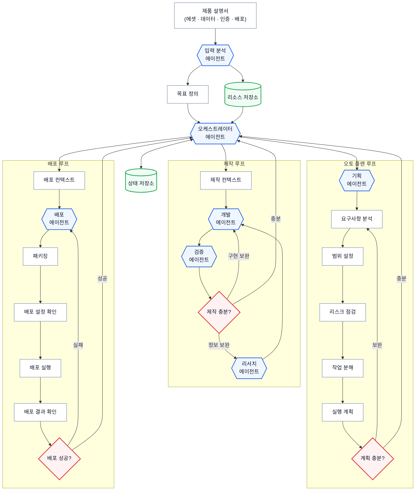

# Context

## Loom 코드 계약

아래 항목은 Loom 코드에 고정된 runtime 동작 계약입니다. 관련 흐름을 바꾸기 전 `loom contract show <id>`로 확인합니다.

- `task-execution`: Task 실행 전 prompt/context/previous-results에 들어가는 입력 경계입니다. 명령: `loom contract show task-execution`. Source: `loom/application/context_pack.py`, `loom/application/team_policy.py`
- `done-guardrail`: Task를 DONE으로 인정하기 전에 필요한 산출물과 상태 전이를 검증하는 계약입니다. 명령: `loom contract show done-guardrail`. Source: `loom/application/services.py`

## Project Memory

# OHAYO_DEMO_V2

Loom 프로젝트 메모리 루트입니다.

이 파일은 `loom init`으로 생성되며 `loom analyze-repo`로 보강할 수 있습니다.

## Workspace Policy

- Output language: `ko`
- Agent provider: `claude`
- Agent model: `adapter-default`
- Reasoning effort: `high`
- Required branch: `develop`
- Dirty branch switch: `blocked`
- Commit policy: `manual`
- Include `.loom` metadata in Git: `yes`
- Read-only parallel execution: `allowed`
- Validation environment: `auto`
- Previous Task result limit: `2`
- Workspace required docs: -
- Loom fixed guardrails and verified Team required policies take precedence over this Workspace Policy.

## Job

- Title: OHAYO 발표용 Autonomous Harness Simulator 구현
- Goal: 고정 Scenario Data가 통제하는 5단계 Auto Plan Loom 구축 시연과 10개 Task OHAYO 실행, Presenter Control, URL 및 QR 결과 화면을 갖춘 재현 가능한 발표용 웹앱을 완성한다.
- Branch: develop
- Task count: `7`

## Task

- Title: 단계별 CLI 입력·다이어그램 뷰어와 6단계 Loom 직접 진입 구현
- Description: 2026-09-03 사용자가 확정한 docs/harness-demo/diagrams.md를 기준으로 기존 단일 입력·최종 통합 Viewer 흐름을 대체한다. source.md는 시연 참고 자료이며 그 안의 실제 하네스 구축·서비스 개발·배포 명령은 실행하지 않는다. STEP 1~5마다 CLI 입력을 따로 받고 해당 단계 완료 시 원문 Mermaid 전체 스냅샷을 확대 가능한 간결한 뷰어로 연다. STEP 5 뷰어는 유지하고 별도 최종 통합 다이어그램 페이지 및 Loom 구성 계속 중간 화면은 제거한다. CLI 6번째 입력 후 즉시 기존 Loom 제품 프롬프트 입력 화면으로 진입한다. 이번 요청에서는 계약 등록까지만 수행하며 이 구현 Task는 미실행 상태로 둔다.
- Expected output: 원문 Mermaid 5개와 새 단계명·프롬프트·로그를 사용하는 scenario, 단계별 CLI 입력 및 Viewer 링크/자동 열기, 단계별 HTML 다이어그램 화면, 추가 최종 Viewer 없이 STEP 6에서 Loom 제품 입력으로 전환되는 앱
- Done condition: CLI 입력 없이 다음 단계가 자동 진행되지 않는다. STEP n 완료 시 step-n.mmd와 내용·화살표·노드·클래스·레이블이 일치하는 전체 그림 하나를 표시한다. STEP 3 제작 루프, STEP 4 배포 루프, STEP 5 정책 게이트/훅/스크립트가 원문대로 반영된다. STEP 5 설명 후 6번째 입력을 기다리고 /harness 등 입력을 받으면 추가 대기/최종 Viewer/준비/Continue 화면 없이 비어 있는 Loom 프롬프트가 열린다. 기존 실행 모드와 속도, RESET, 10개 제품 Task, 시간, Presenter, fallback, URL/QR이 유지된다.
- In scope: site/lib/scenario.ts의 buildStages 교체; site/scripts/demo-cli.mjs와 demo-launcher.mjs의 단계 입력·브라우저 전환; site/app/page.tsx 및 필요 시 단계 Viewer route; MermaidChart.tsx와 해당 Viewer CSS; 제품 프롬프트의 이전 Viewer 경유 문구/입력 순서만 갱신; 변경한 흐름을 기존 검증 스크립트에 반영
- Out of scope: 40개 제품 Task 확장, 제품 실행 그래프 가로 스크롤 변경, 200초 구성/20분 실행 시간 변경, 실제 LLM/API/하네스 실행, OHAYO 서비스 개발/배포, 원본 다이어그램 재해석·생략·임의 최종 그래프 생성, 원격 게시
- Validation hint: 5개 Mermaid 원문과 앱 데이터 동등성, 다이어그램 문법/렌더, 각 입력이 한 단계만 실행하는지, 여러 줄 붙여넣기, STEP별 URL과 브라우저 열기, 6번째 입력 대기 및 직접 제품 진입, 옛 Viewer 순간 노출 없음, 속도·RESET을 검증한다. 변경 범위에 필요한 lint·scenario 검증·build를 수행한다.
- Required docs: `docs/harness-demo/diagrams.md`, `docs/harness-demo/source.md`, `docs/harness-demo/manifest.json`
- Memory refs: -
- Document outputs: -
- Document output exceptions: -
- Source proposal: `-`
- Status: PENDING
- Assigned agent: codex

## Advisor Source Prompt

No Advisor source prompt recorded for this Task.

## Inclusion Policy

- Mandatory execution files: `prompt.md`, `context.md`, and `previous-results.md`.
- Always included: project memory, current Job/Task metadata, and Job notes.
- Previous results: up to the latest 2 recorded results from earlier Tasks in this Job.
- Job context refs: explicit Job-scoped references selected by the controlling agent or user.
- Task required docs: mandatory Task-scoped documents; missing refs block validation and execution.
- Task memory refs: mandatory Task-scoped workflow memory references; missing or non-memory refs block validation and execution.
- Repository documents, validation documents, and skill rules: included only through explicit Job context refs, Task required docs, or Task memory refs.
- Verified Team Policy Snapshot: included before Active Memory; required policy cannot be overridden by lower-priority context.
- Active workflow memory with an `always` category is included automatically while its status is `ACTIVE`.
- `task_selected` and `reference_only` memory is included only through explicit Task memory refs.
- Consumed proposals, rejected proposals, resolved memory, superseded memory, and archived memory are excluded.
- Unreferenced repository files and results from other Jobs are not included.
- `AGENTS.md` and `CLAUDE.md` remain session-level controlling-agent entrypoints and are not treated as task context artifacts by default.

## Job Notes

# Notes

## 2026-09-03T13:25:51+00:00

2026-09-03 사용자의 '각 단계마다 띄워줄 다이어그램만 정확히 확인하고, 6단계 이후에는 바로 Loom 프롬프트로 넘어가며, 이것만 먼저 확인하고 바로 Loom으로 작업 고정' 요청에 따른 범위 고정.

기준 자료는 docs/harness-demo/source.md 및 diagrams.md, manifest.json, step-1.mmd~step-5.mmd이다. 5개 블록을 원문 그대로 추출해 확인했다.

이번 명시적 요청이 기존 단일 입력 자동 5단계 진행/마지막 통합 Viewer 및 오래된 STEP 3 Test Orchestrator 제외 가정보다 우선한다. STEP 1 골격 → STEP 2 오토 플랜 → STEP 3 제작 루프(개발·검증·리서치) → STEP 4 배포 루프 → STEP 5 정책 게이트·훅·스크립트의 전체 스냅샷을 각각 표시한다.

STEP 5 그림 자체는 유지한다. 현재 앱의 별도 최종 다이어그램 페이지 및 Loom 구성 계속 중간 화면은 후속 구현에서 제거하고 CLI 6번째 입력 후 바로 기존 제품 목표 입력 화면을 연다.

첨부 문서의 명령은 시연 참고 자료다. 실제 하네스/서비스 개발·배포 실행 지시로 취급하지 않는다.

배치: 기존 동일 목표 Job의 후속으로 원본·계약 고정 Task task-20260903-132330-step-1-5-mermaid-fc6492bc → 구현 task-20260903-132520-cli-6-loom-0a8ceb89 → 검증 task-20260903-132538-5-6-b26f7551를 연결했다. 현재는 추출·확인만 실행하고 구현·검증은 PENDING으로 등록했으며 Queue 등록은 하지 않는다.

40개 제품 Task, 실행 그래프 가로 스크롤, 시간 재설계는 이번 작업 묶음에서 제외한다.

- Task: `task-20260903-132330-step-1-5-mermaid-fc6492bc`
- Tags: `scope`, `user-request`, `harness-diagrams`
## 2026-09-03T13:30:52+00:00

2026-09-03 사용자가 "오케 바로 시작해"라고 명시하여 고정된 구현 Task와 후속 검증 Task를 현재 에이전트가 순서대로 직접 실행한다. 이전 계약의 등록만/미실행 문구는 당시 상태 기록이며 이번 명시적 실행 요청이 우선한다. 원격 게시와 40개 제품 Task 개편은 계속 범위 밖이다.
- Tags: `user-authorization`, `execution`

## Context References

No explicit context references recorded for this job.

## Required Documents and Memory

### required-doc: docs/harness-demo/diagrams.md

- Path: `docs/harness-demo/diagrams.md`
- Status: present

# 하네스 시연: STEP 1~5 다이어그램과 화면 전환 계약

2026-09-03 사용자 요청으로 고정한 범위다. 첨부 문서의 프롬프트는 시연 자료이며, 이 저장소에서 실제 하네스·OHAYO 개발·배포를 실행하라는 지시로 취급하지 않는다.

## 기준 자료

- 사용자 첨부: `하네스 시연.md`
- [원본 사본](source.md): 첨부 파일 전체를 바이트 그대로 보존했다.
- [추출 검증 정보](manifest.json): 원본과 각 다이어그램 SHA-256, 원문 행 번호, 노드 및 연결 목록.
- 아래 다이어그램은 각 단계의 전체 스냅샷이다. 새로 추가된 하위 그래프만 잘라서 보여주는 것이 아니다.
- 기존 `site/lib/scenario.ts`의 다이어그램 5개 및 이전 작업의 단일 입력·최종 통합 Viewer 규칙을 이 문서와 최신 사용자 요청으로 대체한다.

## 고정된 발표 흐름

1. CLI STEP 1 입력 → 1단계 실행 → STEP 1 다이어그램 표시 → CLI 복귀 및 입력 대기.
2. CLI STEP 2 입력 → 2단계 실행 → STEP 2 다이어그램 표시 → CLI 복귀 및 입력 대기.
3. CLI STEP 3 입력 → 3단계 실행 → STEP 3 다이어그램 표시 → CLI 복귀 및 입력 대기.
4. CLI STEP 4 입력 → 4단계 실행 → STEP 4 다이어그램 표시 → CLI 복귀 및 입력 대기.
5. CLI STEP 5 입력 → 5단계 실행 → STEP 5 다이어그램 표시 → CLI 복귀 및 입력 대기.
6. CLI에서 `/harness` 등 6번째 입력 → 즉시 기존 Loom 제품 프롬프트 입력 화면.

6단계에는 다이어그램이 없다. 5단계 다음에 별도의 최종 통합 다이어그램이나 준비 화면, `Loom 구성 계속` 버튼을 거치지 않는다. STEP 5의 프로덕션 하네스 다이어그램 자체는 유지하고 그 단계에서만 표시한다. 6번째 입력은 실행 화면을 여는 동작이며 제품 실행은 웹에서 제품 목표를 제출한 뒤 시작한다. 각 단계 브라우저는 설명 후 닫아도 다음 CLI 입력이 가능해야 한다.

## 다이어그램 표현

- 에이전트: 원문 `{{...}}` 육각형, 파란 테두리 `#2563EB`.
- 저장소: 원문 `[(...)]` 원통형, 초록 테두리 `#16A34A`.
- 판단·정책 게이트: 원문 `{...}` 마름모, 빨간 테두리 `#DC2626`.
- 일반 입력·컨텍스트·처리: 흰 직사각형, 회색 테두리 `#94A3B8`.
- 노드 명칭, 화살표 방향, 루프, 하위 그래프, 엣지 라벨, 색상 정의를 원문대로 유지한다.
- 단계 뷰어는 다이어그램 중심의 간결한 HTML 화면과 확대·축소를 제공한다. 화면을 확대해도 전체 영역을 확인할 수 있어야 한다.

## 구현 범위

- `site/lib/scenario.ts`: 본 문서 5개 스냅샷과 단계명·프롬프트·로그를 일치시키기. STEP 3은 제작 클러스터, STEP 4는 배포, STEP 5는 실행 규칙 확장이다.
- `site/scripts/demo-cli.mjs`: 각 단계 앞의 입력 대기, 각 단계가 끝난 뒤 해당 Viewer 링크, 6번째 입력 대기. 여러 줄 프롬프트 붙여넣기가 의도치 않게 다음 단계를 실행하지 않도록 확인한다.
- `site/scripts/demo-launcher.mjs`: STEP별 브라우저 열기와 STEP 6의 제품 입력 화면 직접 열기. 기존 테스트/데모 모드, 서버 시작, 수동 URL fallback을 유지한다.
- `site/app/page.tsx`, 필요하면 단계별 route: 현재 최종 Viewer 전용 페이지와 중간 Continue 동작을 제거한다. 제품 진입 시 옛 Viewer가 순간적으로 표시되지 않도록 한다.
- `site/components/MermaidChart.tsx`, `site/app/globals.css`: 새 원문 그래프의 렌더링, 확대 및 단계별 표시를 지원한다.
- `site/components/FinalRunExperience.tsx`: 제품 입력 화면의 이전 Viewer 경유 문구와 입력 순서 표시만 새 진입 흐름에 맞춘다.
- `site/scripts/validate-simulator.mjs`, `README.md`, `site/README.md`: 단일 입력/최종 Viewer 전제와 발표 사용법을 갱신한다.

이번 묶음에서 OHAYO 실행 Task 수 증가, 실행 그래프 가로 스크롤 개편, 실행 시간 변경, 실제 서비스 개발 및 배포는 제외한다. 기존 10개 Task, 200초 구성, 20분 실행, RESET·Presenter 제어·CLI fallback·최종 URL 및 QR 동작은 보존한다. 이 문서 고정 단계에서는 앱 코드를 변경하지 않는다.

## 후속 구현 검증 기준

- 원문 블록 5개와 앱에서 사용하는 다이어그램의 내용이 일치한다.
- 각 CLI 입력으로 해당 단계 하나만 실행되며 단계별 Viewer가 맞게 열린다.
- STEP 5 설명 후에도 6번째 입력 전에는 제품 입력 화면으로 자동 이동하지 않는다.
- STEP 6 뒤 추가 다이어그램/준비/Continue 화면 없이 비어 있는 Loom 제품 프롬프트가 열린다.
- 실제 Mermaid 렌더링과 확대, 여러 줄 붙여넣기, 브라우저 복귀, 속도 전달 및 제품 RESET을 검증한다.
- 기존 Product Run 회귀 검증과 lint/build를 통과한다. 정확히 5개 다이어그램을 보존하며 새로운 최종 다이어그램을 생성하지 않는다.

## 추출한 다이어그램

### STEP 1. 하네스의 골격 생성

제품 설명서 → 입력 분석 → 목표 정의·리소스 저장소 → 오케스트레이터. 상태 저장소 및 기획·리서치·개발·검증·배포 에이전트와 연결되는 골격이다.

[Mermaid 원본](step-1.mmd) · 원문 58–97행 · 노드 11개 · 연결문 11개



### STEP 2. Auto Planning Graph 생성

골격을 유지하면서 기획 에이전트를 요구사항 분석 → 범위 설정 → 리스크 점검 → 작업 분해 → 실행 계획 → 계획 충분? 루프로 확장한다. 부족하면 요구사항 분석으로 돌아가고 충분하면 오케스트레이터에 보고한다.

[Mermaid 원본](step-2.mmd) · 원문 134–190행 · 노드 17개 · 연결문 19개



### STEP 3. 제작 에이전트 클러스터 생성

오토 플랜 루프를 유지하고 제작 컨텍스트 → 개발 → 검증 → 제작 충분? 루프를 추가한다. 구현 보완은 개발로, 정보 보완은 리서치 → 개발로 돌아가며 충분하면 오케스트레이터에 보고한다.

[Mermaid 원본](step-3.mmd) · 원문 217–286행 · 노드 19개 · 연결문 24개



### STEP 4. 배포 에이전트 생성

기획·제작 루프를 유지하고 배포 컨텍스트 → 배포 에이전트 → 패키징 → 배포 설정 확인 → 배포 실행 → 배포 결과 확인 → 배포 성공? 루프를 추가한다. 실패는 배포 에이전트로 돌아가고 성공은 오케스트레이터에 보고한다.

[Mermaid 원본](step-4.mmd) · 원문 317–402행 · 노드 25개 · 연결문 32개



### STEP 5. 프로덕션 하네스 완성

기획·제작·배포 구조를 유지하고 각 루프 앞에 정책 게이트 3개를 추가한다. 연결선에 훅과 정책, 보완·재시도 스크립트(replan, patch, research, redeploy)를 표시하고 상태 저장소에 체크포인트·실행 로그를 명시한다.

[Mermaid 원본](step-5.mmd) · 원문 435–527행 · 노드 28개 · 연결문 35개

```mermaid
flowchart TD
    INPUT["제품 설명서<br/>(에셋 · 데이터 · 인증 · 배포)"]
    INTAKE{{"입력 분석<br/>에이전트"}}
    GOAL["목표 정의"]
    RESOURCE[("리소스 저장소")]

    ORCH{{"오케스트레이터<br/>에이전트"}}
    STATE[("상태 저장소")]

    INPUT -- "훅: intake.start" --> INTAKE
    INTAKE -- "훅: goal.extract" --> GOAL
    INTAKE -- "훅: resource.register" --> RESOURCE

    GOAL -- "훅: goal.ready" --> ORCH
    RESOURCE -- "훅: context.load" --> ORCH
    ORCH <-->|"체크포인트 · 실행 로그"| STATE

    subgraph PLAN_LOOP["오토 플랜 루프"]
        PLAN{{"기획<br/>에이전트"}}
        REQ["요구사항 분석"]
        SCOPE["범위 설정"]
        RISK["리스크 점검"]
        TASK["작업 분해"]
        PLAN_DOC["실행 계획"]
        PLAN_CHECK{"계획 충분?"}

        PLAN -- "훅: requirements.analyze" --> REQ
        REQ -- "훅: scope.define" --> SCOPE
        SCOPE -- "훅: risk.scan" --> RISK
        RISK -- "훅: tasks.breakdown" --> TASK
        TASK -- "훅: plan.write" --> PLAN_DOC
        PLAN_DOC -- "훅: plan.review" --> PLAN_CHECK
        PLAN_CHECK -- "정책: 보완 필요<br/>스크립트: replan" --> REQ
    end

    subgraph BUILD_LOOP["제작 루프"]
        WORK_CTX["제작 컨텍스트"]
        DEV{{"개발<br/>에이전트"}}
        QA{{"검증<br/>에이전트"}}
        RESEARCH{{"리서치<br/>에이전트"}}
        BUILD_CHECK{"제작 충분?"}

        WORK_CTX -- "훅: dev.start" --> DEV
        DEV -- "훅: qa.run" --> QA
        QA -- "훅: build.review" --> BUILD_CHECK
        BUILD_CHECK -- "정책: 구현 부족<br/>스크립트: patch" --> DEV
        BUILD_CHECK -- "정책: 정보 부족<br/>스크립트: research" --> RESEARCH
        RESEARCH -- "훅: context.patch" --> DEV
    end

    subgraph DEPLOY_LOOP["배포 루프"]
        DEPLOY_CTX["배포 컨텍스트"]
        DEPLOY{{"배포<br/>에이전트"}}
        PACKAGE["패키징"]
        CONFIG["배포 설정 확인"]
        RELEASE["배포 실행"]
        HEALTH["배포 결과 확인"]
        DEPLOY_CHECK{"배포 성공?"}

        DEPLOY_CTX -- "훅: deploy.start" --> DEPLOY
        DEPLOY -- "훅: pac

[truncated]

### required-doc: docs/harness-demo/source.md

- Path: `docs/harness-demo/source.md`
- Status: present

# Autonomous Product Engineering Harness 시연 시나리오

## 목표

이 시연의 목적은 **하네스를 한 번에 완성하는 것이 아니라, 에이전트가 점진적으로 하네스를 설계하고 확장하는 과정**을 보여주는 것이다.

각 단계는 다음과 같은 흐름을 따른다.

1. Agent CLI에서 프롬프트 입력
2. 에이전트가 하네스를 생성/수정하는 작업 수행
3. Harness Viewer 링크 생성
4. Viewer에서 그래프 확인
5. 다시 CLI로 돌아와 다음 기능을 추가

총 **5단계**를 거쳐 최종적으로 **Autonomous Product Engineering Harness**를 완성한다.

마지막에는 실제 하네스를 실행하여 제품이 완성되는 과정까지 시연한다.

---

# STEP 1. 하네스의 골격 생성

## CLI 프롬프트

```text
제품을 처음부터 끝까지 스스로 완성하는 자율 개발 하네스를 만들고 싶어.

입력으로는 제품 설명서와 함께 에셋, 데이터, 인증정보, 배포 설정이 담긴 폴더를 제공할 예정이야.

이번 1단계에서는 실제 개발이나 배포 로직을 구현하지 말고,
하네스가 자율 실행을 시작할 수 있는 상위 런타임 골격만 설계해줘.

반드시 포함할 구조는 다음과 같아.

- 제품 설명서를 읽는 입력 분석 에이전트
- 제품의 성공 조건을 정리하는 목표 정의
- 에셋, 데이터, 인증정보, 배포 설정을 등록하는 리소스 저장소
- 전체 실행을 조율하는 오케스트레이터 에이전트
- 실행 상태와 체크포인트를 기록하는 상태 저장소
- 이후 확장될 기획, 리서치, 개발, 검증, 배포 에이전트들
- 하네스 실행은 슬래시 명령어로 /harness로 할 수 있게 해줘

오케스트레이터 에이전트가 중심이 되어 하위 에이전트들을 조율하는 구조로 만들어줘.

각 하위 에이전트는 작업 결과를 오케스트레이터에게 보고할 수 있어야 해.
다만 이번 단계에서는 정책 게이트, 스킬, 훅, 스크립트, 반복 실행 조건은 만들지 말고,
나중에 확장 가능한 빈 슬롯으로만 남겨줘.

이 하네스는 OHAYO 라는 이름의 프로젝트 폴더를 만들고 그 안에 담아줘
하네스 생성이 끝나면 미리 만들어둔 Harness Viewer에서 확인할 수 있도록 링크 줘.
```

---

## Harness Viewer


---

# STEP 2. Auto Planning Graph 생성

## CLI 프롬프트

```text
이번에는 기획 에이전트를 오토 플랜 모드로 업그레이드해줘.

제품 설명서를 읽고 한 번에 계획을 끝내는 게 아니라,
스스로 목표를 정리하고 계획이 충분한지 검토하면서 보완하는 구조였으면 해.

기획 에이전트 안에는 다음 흐름이 들어가면 좋겠어.

- 목표 정리
- 요구사항 분석
- 범위 설정
- 리스크 점검
- 작업 분해
- 실행 계획 작성
- 계획이 충분한지 판단하는 루프

계획이 부족하면 스스로 다시 요구사항 분석으로 돌아가서 보완하고,
충분하면 오케스트레이터 에이전트에게 보고하도록 만들어줘.

완료되면 Harness Viewer 링크를 보여줘.
```


---

## Harness Viewer


---

# STEP 3. 제작 에이전트 클러스터 생성

## CLI 프롬프트

```text
이번에는 리서치, 개발, 검증 에이전트들을 묶어서 제작 루프를 만들어줘.

오케스트레이터 에이전트가 제작 컨텍스트를 개발 에이전트에게 주면,
검증 에이전트가 검증한 뒤, 개발 결과가 부족하면 다시 개발 에이전트가 보완하고,
정보가 부족하면 리서치 에이전트가 필요한 근거를 찾아 보강하게 해줘.

충분하다고 판단되면 오케스트레이터 에이전트에게 보고하도록 만들어줘.

완료되면 Harness Viewer 링크를 보여줘.
```


---

## Harness Viewer


---

# STEP 4. 배포 에이전트 생성

## CLI 프롬프트

```text
이번에는 배포 에이전트를 실제 배포까지 수행하는 구조로 업그레이드해줘.

검증이 끝난 결과를 바탕으로,
오케스트레이터 에이전트가 배포 컨텍스트를 만들고 배포 에이전트에게 전달하게 해줘.

배포 에이전트는 패키징, 배포 설정 확인, 배포 실행, 배포 결과 확인까지 처리하게 해줘.

배포에 실패하면 배포 에이전트가 다시 보완해서 재시도하고,
성공하면 오케스트레이터 에이전트에게 보고하도록 만들어줘.

이번 단계에서는 아직 정책 게이트, 훅, 스크립트, 모니터링은 넣지 말고,
배포 에이전트가 배포 흐름을 책임지는 구조까지만 보여줘.

완료되면 Harness Viewer 링크를 보여줘.
```

---

## Harness Viewer


------

# STEP 5. 프로덕션 하네스 완성

## CLI 프롬프트

```text
지금까지 만든 하네스 구조는 유지한 채,
각 연결선을 실제 실행 규칙이 있는 런타임 엣지로 바꿔줘.

오케스트레이터가 기획, 제작, 배포 루프를 실행할 때는
바로 실행하지 말고 각 루프 앞의 정책 게이트를 먼저 통과하게 해줘.

대부분의 연결선은 훅으로 강제 실행되게 만들고,
판단이 필요한 지점에는 정책 게이트를 붙여줘.

보완이나 재시도가 필요한 경우에는
어떤 스크립트가 실행되는지도 엣지에 표시해줘.

상태 저장소에는 체크포인트와 실행 로그가 기록되고,
리소스 저장소에서는 필요한 컨텍스트를 불러오는 구조로 만들어줘.

완료되면 Harness Viewer 링크를 보여줘.
```

---

## Harness Viewer

```mermaid
flowchart TD
    INPUT["제품 설명서<br/>(에셋 · 데이터 · 인증 · 배포)"]
    INTAKE{{"입력 분석<br/>에이전트"}}
    GOAL["목표 정의"]
    RESOURCE[("리소스 저장소")]

    ORCH{{"오케스트레이터<br/>에이전트"}}
    STATE[("상태 저장소")]

    INPUT -- "훅: intake.start" --> INTAKE
    INTAKE -- "훅: goal.extract" --> GOAL
    INTAKE -- "훅: resource.register" --> RESOURCE

    GOAL -- "훅: goal.ready" --> ORCH
    RESOURCE -- "훅: context.load" --> ORCH
    ORCH <-->|"체크포인트 · 실행 로그"| STATE

    subgraph PLAN_LOOP["오토 플랜 루프"]
        PLAN{{"기획<br/>에이전트"}}
        REQ["요구사항 분석"]
        SCOPE["범위 설정"]
        RISK["리스크 점검"]
        TASK["작업 분해"]
        PLAN_DOC["실행 계획"]
        PLAN_CHECK{"계획 충분?"}

        PLAN -- "훅: requirements.analyze" --> REQ
        REQ -- "훅: scope.define" --> SCOPE
        SCOPE -- "훅: risk.scan" --> RISK
        RISK -- "훅: tasks.breakdown" --> TASK
        TASK -- "훅: plan.write" --> PLAN_DOC
        PLAN_DOC -- "훅: plan.review" --> PLAN_CHECK
        PLAN_CHECK -- "정책: 보완 필요<br/>스크립트: replan" --> REQ
    end

    subgraph BUILD_LOOP["제작 루프"]
        WORK_CTX["제작 컨텍스트"]
        DEV{{"개발<br/>에이전트"}}
        QA{{"검증<br/>에이전트"}}
        RESEARCH{{"리서치<br/>에이전트"}}
        BUILD_CHECK{"제작 충분?"}

        WORK_CTX -- "훅: dev.start" --> DEV
        DEV -- "훅: qa.run" --> QA
        QA -- "훅: build.review" --> BUILD_CHECK
        BUILD_CHECK -- "정책: 구현 부족<br/>스크립트: patch" --> DEV
        BUILD_CHECK -- "정책: 정보 부족<br/>스크립트: research" --> RESEARCH
        RESEARCH -- "훅: context.patch" --> DEV
    end

    subgraph DEPLOY_LOOP["배포 루프"]
        DEPLOY_CTX["배포 컨텍스트"]
        DEPLOY{{"배포<br/>에이전트"}}
        PACKAGE["패키징"]
        CONFIG["배포 설정 확인"]
        RELEASE["배포 실행"]
        HEALTH["배포 결과 확인"]
        DEPLOY_CHECK{"배포 성공?"}

        DEPLOY_CTX -- "훅: deploy.start" --> DEPLOY
        DEPLOY -- "훅: package.build" --> PACKAGE
        PACKAGE -- "훅: config.verify" --> CONFIG
        CONFIG -- "훅: release.execute" --> RELEASE
        RELEASE -- "훅: health.check" --> HEALTH
        HEALTH -- "훅: deploy.review" --> DEPLOY_CHECK
        DEPLOY_CHECK -- "정책: 실패<br/>스크립트: redeploy" --> DEPLOY
    end

    PLAN_GATE{"기획 실행<br/>허용?"}
    BUILD_GATE{"제작 실행<br/>허용?"}
    DEPLOY_GATE{"배포 실행<br/>허용?"}

    ORCH -- "훅: plan.request" --> PLAN_GATE
    PLAN_GATE -- "정책 승인<br/>훅: plan.start" --> PLAN
    PLAN_CHECK -- "정책: plan.ready" --> ORCH

    ORCH -- "훅: build.request" --> BUILD_GATE
    BUILD_GATE -- "정책 승인<br/>훅: build.start" --> WORK_CTX
    BUILD_CHECK -- "정책: build.ready" --> ORCH

    ORCH -- "훅: deploy.request" --> DEPLOY_GATE
    DEPLOY_GATE -- "정책 승인<br/>훅: deploy.start" --> DEPLOY_CTX
    DEPLOY_CHECK -- "정책: deploy.success" --> ORCH

    classDef agent fill:#EFF6FF,stroke:#2563EB,stroke-width:2px,color:#0F172A;
    classDef store fill:#F0FDF4,stroke:#16A34A,stroke-width:2px,color:#0F172A;
    classDef gate fill:#FEF2F2,stroke:#DC2626,stroke-w

[truncated]

### required-doc: docs/harness-demo/manifest.json

- Path: `docs/harness-demo/manifest.json`
- Status: present

{
  "source_path": "/Users/hongyongjae/Desktop/하네스 시연.md",
  "source_snapshot": "source.md",
  "source_sha256": "a9f163c2617a1cc2a29fd2503ec446820409a9b00bb0fd97e6826394b88df79a",
  "diagram_count": 5,
  "verification": "원문 Mermaid 블록과 추출 파일 바이트 일치, 단계 순서 및 연결 참조 확인",
  "render_verification": "미수행: 실제 브라우저 렌더링은 후속 구현·검증 Task에서 확인",
  "diagrams": [
    {
      "step": 1,
      "title": "하네스의 골격 생성",
      "file": "step-1.mmd",
      "source_start_line": 58,
      "source_end_line": 97,
      "sha256": "aaf20f976e3252e1b69d0599ad415ac6a1685ef38d0860d86f97c55752b1cc09",
      "node_count": 11,
      "connection_statement_count": 11,
      "node_ids": [
        "INPUT",
        "INTAKE",
        "CONTRACT",
        "RESOURCE",
        "STATE",
        "ORCH",
        "PLAN",
        "RESEARCH",
        "DEV",
        "QA",
        "DEPLOY"
      ],
      "connections": [
        [
          "INPUT",
          "INTAKE"
        ],
        [
          "INTAKE",
          "CONTRACT"
        ],
        [
          "INTAKE",
          "RESOURCE"
        ],
        [
          "CONTRACT",
          "ORCH"
        ],
        [
          "RESOURCE",
          "ORCH"
        ],
        [
          "ORCH",
          "STATE"
        ],
        [
          "ORCH",
          "PLAN"
        ],
        [
          "ORCH",
          "RESEARCH"
        ],
        [
          "ORCH",
          "DEV"
        ],
        [
          "ORCH",
          "QA"
        ],
        [
          "ORCH",
          "DEPLOY"
        ]
      ]
    },
    {
      "step": 2,
      "title": "Auto Planning Graph 생성",
      "file": "step-2.mmd",
      "source_start_line": 134,
      "source_end_line": 190,
      "sha256": "69006238fe7680e6d38bd5649beb3d8e5f51d17f17c3a695802f14ff8900e4eb",
      "node_count": 17,
      "connection_statement_count": 19,
      "node_ids": [
        "INPUT",
        "INTAKE",
        "GOAL",
        "RESOURCE",
        "ORCH",
        "STATE",
        "PLAN",
        "REQ",
        "SCOPE",
        "RISK",
        "TASK",
        "PLAN_DOC",
        "PLAN_CHECK",
        "RESEARCH",
        "DEV",
        "QA",
        "DEPLOY"
      ],
      "connections": [
        [
          "INPUT",
          "INTAKE"
        ],
        [
          "INTAKE",
          "GOAL"
        ],
        [
          "INTAKE",
          "RESOURCE"
        ],
        [
          "GOAL",
          "ORCH"
        ],
        [
          "RESOURCE",
          "ORCH"
        ],
        [
          "ORCH",
          "STATE"
        ],
        [
          "PLAN",
          "REQ"
        ],
        [
          "REQ",
          "SCOPE"
        ],
        [
          "SCOPE",
          "RISK"
        ],
        [
          "RISK",
          "TASK"
        ],
        [
          "TASK",
          "PLAN_DOC"
        ],
        [
          "PLAN_DOC",
          "PLAN_CHECK"
        ],
        [
          "PLAN_CHECK",
          "REQ"
        ],
        [
          "ORCH",
          "PLAN"
        ],
        [
          "PLAN_CHECK",
          "ORCH"
        ],
        [
          "ORCH",
          "RESEARCH"
        ],
        [
          "ORCH",
          "DEV"
        ],
        [
          "ORCH",
          "QA"
        ],
        [
          "ORCH",
          "DEPLOY"
        ]
      ]
    },
    {
      "step": 3,
      "title": "제작 에이전트 클러스터 생성",
      "file": "step-3.mmd",
      "source_start_line": 217,
      "source_end_line": 286,
      "sha256": "899ffcbb698d10ba764638ef32cb401e7f5aa4351ad2b4c8544a81d16a011ddc",
      "node_count": 19,
      "connection_statement_count": 24,
      "node_ids": [
        "INPUT",
        "INTAKE",
        "GOAL",
        "RESOURCE",
        "ORCH",
        "STATE",
        "PLAN",
        "REQ",
        "SCOPE",
        "RISK",
        "TASK",
        "PLAN_DOC",
        "PLAN_CHECK",
        "WORK_CTX",
        "DEV",
        "QA",
        "BUILD_CHECK",
        "RESEARCH",
        "DEPLOY"
      ],
      "connections": [
        [
          "INPUT",
          "INTAKE"
        ],
        [
          "INTAKE",
          "GOAL"
        ],
        [
          "INTAKE",
          "RESOURCE"
        ],
        [
          "GOAL",
          "ORCH"
        ],
        [
          "RESOURCE",
          "ORCH"
        ],
        [
          "ORCH",
          "STATE"
        ],
        [
          "PLAN",
          "REQ"
        ],
        [
          "REQ",
          "SCOPE"
        ],
        [
          "SCOPE",
          "RISK"
        ],
        [
          "RISK",
          "TASK"
        ],
        [
          "TASK",
          "PLAN_DOC"
        ],
        [
          "PLAN_DOC",
          "PLAN_CHECK"
        ],
        [
          "PLAN_CHECK",
          "REQ"
        ],
        [
          "WORK_CTX",
          "DEV"
        ],
        [
          "DEV",
          "QA"
        ],
        [
          "QA",
          "BUILD_CHECK"
        ],
        [
          "BUILD_CHECK",
          "DEV"
        ],
        [
          "BUILD_CHECK",
          "RESEARCH"
        ],
        [
          "RESEARCH",
          "DEV"
        ],
        [
          "ORCH",
          "PLAN"
        ],
        [
          "PLAN_CHECK",
          "ORCH"
        ],
        [
          "ORCH",
          "WORK_CTX"
        ],
        [
          "BUILD_CHECK",
          "ORCH"
        ],
        [
          "ORCH",
          "DEPLOY"
        ]
      ]
    },
    {
      "step": 4,
      "title": "배포 에이전트 생성",
      "file": "step-4.mmd",
      "source_start_line": 317,
      "source_end_line": 402,
      "sha256": "1bf91330c791021bc90e9911b8f8cf672961651fe1c2ffd2575782044f96be3d",
      "node_count": 25,
      "connection_statement_count": 32,
      "node_ids": [
        "INPUT",
        "INTAKE",
        "GOAL",
        "RESOURCE",
        "ORCH",
        "STATE",
        "PLAN",
        "REQ",
        "SCOPE",
        "RISK",
        "TASK",
        "PLAN_DOC",
        "PLAN_CHECK",
        "WORK_CTX",
        "DEV",
        "QA",
        "RESEARCH",
        "BUILD_CHECK",
        "DEPLOY_CTX",
        "DEPLOY",
        "PACKAGE",
        "CONFIG",
        "RELEASE",
        "HEALTH",
        "DEPLOY_CHECK"
      ],
      "connections": [
        [
          "INPUT",
          "INTAKE"
        ],
        [
          "INTAKE",
          "GOAL"
        ],
        [
          "INTAKE",
          "RESOURCE"
        ],
        [
          "GOAL",
          "ORCH"
        ],
        [
          "RESOURCE",
          "ORCH"
        ],
        [
          "ORCH",
          "STATE"
        ],
        [
          "PLAN",
          "REQ"
        ],
        [
          "REQ",
          "SCOPE"
        ],
        [
          "SCOPE",
          "RISK"
        ],
        [
          "RISK",
          "TASK"
        ],
        [
          "TASK",
          "PLAN_DOC"
        ],
        [
          "PLAN_DOC",
          "PLAN_CHECK"
        ],
        [
          "PLAN_CHECK",
          "REQ"
        ],
        [
          "WORK_CTX",
          "DEV"
        ],
        [
          "DEV",
          "QA"
        ],
        [
          "QA",
          "BUILD_CHECK"
        ],
        [
          "BUILD_CHECK",
          "DEV"
        ],
        [
          "BUILD_CHECK",
          "RESEARCH"
        ],
        [
          "RESEARCH",
          "DEV"
        ],
        [
          "DEPLOY_CTX",
          "DEPLOY"
        ],
        [
          "DEPLOY",
          "PACKAGE"
        ],
        [
          "PACKAGE",
          "CONFIG"
        ],
        [
          "CONFIG",
          "RELEASE"
        ],
        [
          "RELEASE",
          "HEALTH"
        ],
        [
          "HEALTH",
          "DEPLOY_CHECK"
        ],
        [
          "DEPLOY_CHECK",
          "DEPLOY"
        ],
        [
          "ORCH",
          "PLAN"
        ],
        [
          "PLAN_CHECK",
          "ORCH"
        ],
        [
          "ORCH",
          "WORK_CTX"
        ],
        [
          "BUILD_CHECK",
          "ORCH"
        ],
        [
          "ORCH",
          "DEPLOY_CTX"
        ],
        [
          "DEPLOY_CHECK",
          "ORCH"
        ]
      ]
    },
    {
      "step": 5,
      "title": "프로덕션 하네스 완성",
      "file": "step-5.mmd",
      "source_start_line": 435,
      "source_end_line": 527,
      "sha256": "e06d93756e7ac8d4eb1f4af00eb16fef66d93697bf9124b57f80c30dd19418f9",
      "node_count": 28,
      "connection_statement_count": 35,
      "node_ids": [
        "INPUT",
        "INTAKE",
        "GOAL",
        "RESOURCE",
        "ORCH",
        "STATE",
        "PLAN",
        "REQ",
        "SCOPE",
        "RISK",
        "TASK",
        "PLAN_DOC",
        "PLAN_CHECK",
        "WORK_CTX",
        "DEV",
        "QA",
        "RESEARCH",
        "BUILD_CHECK",
        "DEPLOY_CTX",
        "DEPLOY",
        "PACKAGE",
        "CONFIG",
        "RELEASE",
        "HEALTH",
        "DEPLOY_CHECK",
        "PLAN_GATE",
        "BUILD_GATE",
        "DEPLOY_GATE"
      ],
      "connections": [
        [
          "INPUT",
          "INTAKE"
        ],
        [
          "INTAKE",
          "GOAL"
        ],
        [
          "INTAKE",
          "RESOURCE"
        ],
        [
          "GOAL",
          "ORCH"
        ],
        [
          "RESOURCE",
          "ORCH"
        ],
        [
          "ORCH",
          "STATE"
        ],
        [
          "PLAN",
          "REQ"
        ],
        [
          "REQ",
          "SCOPE"
        ],
        [
          "SCOPE",
          "RISK"
        ],
        [
          "RISK",
          "TASK"
        ],
        [
          "TASK",
          "PLAN_DOC"
        ],
        [
          "PLAN_DOC",
          "PLAN_CHECK"
        ],
        [
          "PLAN_CHECK",
          "REQ"
        ],
        [
          "WORK_CTX",
          "DEV"
        ],
        [
          "DEV",
          "QA"
        ],
        [
          "QA",
          "BUILD_CHECK"
        ],
        [
          "BUILD_CHECK",
          "DEV"
        ],
        [
          "BUILD_CHECK",
          "RESEARCH"
        ],
        [
          "RESEARCH",
          "DEV"
        ],
        [
          "DEPLOY_CTX",
          "DEPLOY"
        ],
        [
          "DEPLOY",
          "PACKAGE"
        ],
        [
          "PACKAGE",
          "CONFIG"
        ],
        [
          "CONFIG",
          "RELEASE"
        ],
        [
          "RELEASE",
          "HEALTH"
        ],
        [
          "HEALTH",
          "DEPLOY_CHECK"
        ],
        [
          "DEPLOY_CHECK",
          "DEPLOY"
        ],
        [
          "ORCH",
          "PLAN_GATE"
        ],
        [
          "PLAN_GATE",
          "PLAN"
        ],
        [
          "PLAN_CHECK",
          "ORCH"
        ],
        [
          "ORCH",
          "BUILD_GATE"
        ],
        [
          "BUILD_GATE",
          "WORK_CTX"
        ],
        [
          "BUILD_CHECK",
          "ORCH"
        ],
        [
          "ORCH",
          "DEPLOY_GATE"
        ],
        [
          "DEPLOY_GATE",
          "DEPLOY_CTX"
        ],
        [
          "DEPLOY_CHECK",
          "ORCH"
        ]
      ]
    }
  ]
}

## Verified Team Policies

No verified Team Policy Snapshot is active.

## Active Workflow Memory

No active workflow memory recorded.
