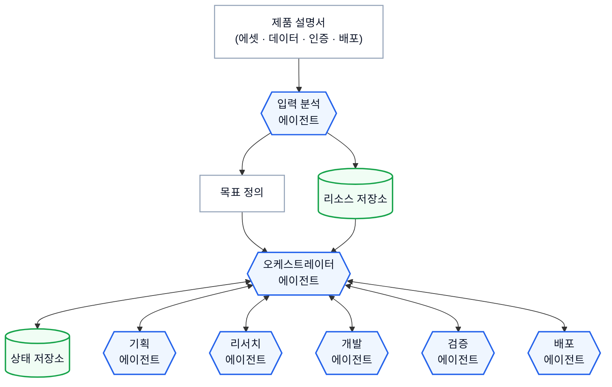
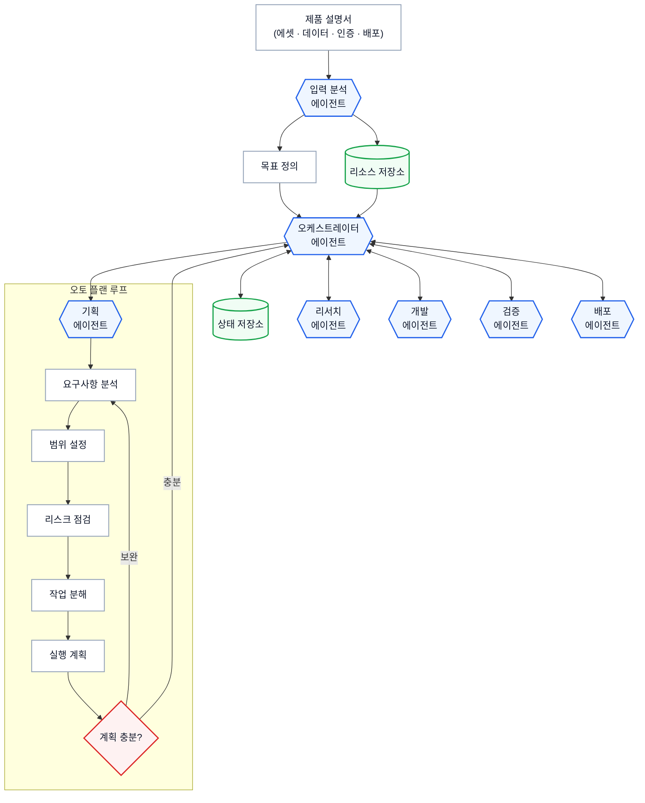
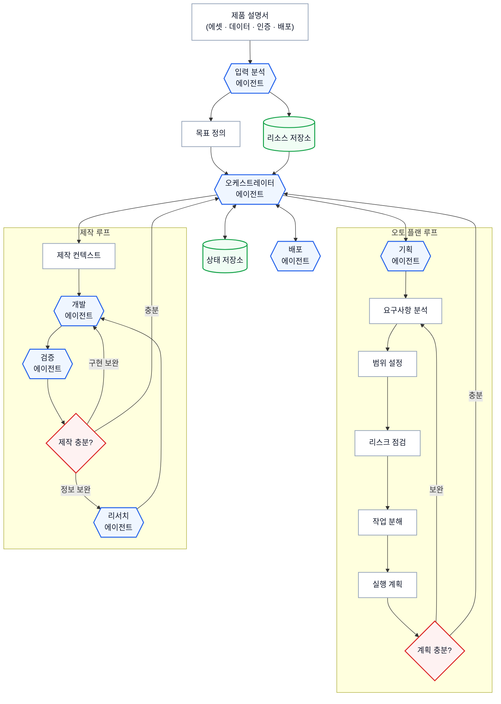
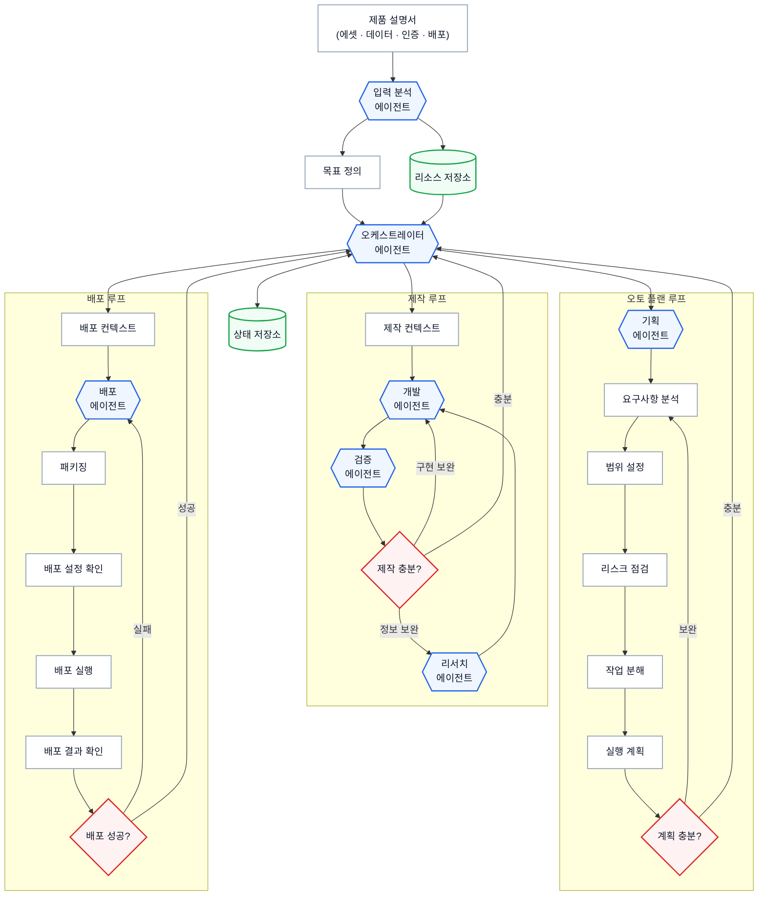
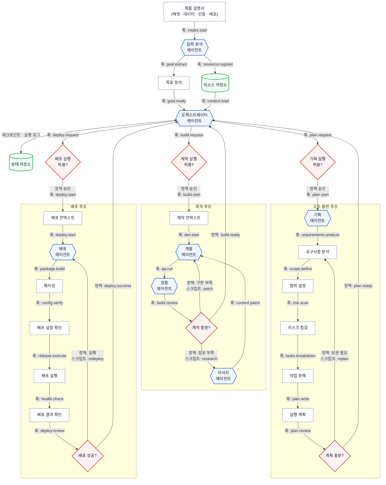

# 하네스 시연: STEP 1~5 다이어그램과 화면 전환 계약

2026-09-03 사용자 요청으로 고정한 범위다. 첨부 문서의 프롬프트는 시연 자료이며, 이 저장소에서 실제 하네스·OHAYO 개발·배포를 실행하라는 지시로 취급하지 않는다.

## 기준 자료

- 사용자 첨부: `하네스 시연.md`
- [원본 사본](source.md): 첨부 파일 전체를 바이트 그대로 보존했다.
- [추출 검증 정보](manifest.json): 원본과 각 다이어그램 SHA-256, 원문 행 번호, 노드 및 연결 목록.
- 아래 다이어그램은 각 단계의 전체 스냅샷이다. 새로 추가된 하위 그래프만 잘라서 보여주는 것이 아니다.
- 기존 `site/lib/scenario.ts`의 다이어그램 5개 및 이전 작업의 단일 입력·최종 통합 Viewer 규칙을 이 문서와 최신 사용자 요청으로 대체한다.

## 고정된 발표 흐름

1. CLI STEP 1 입력 → 1단계 실행 → STEP 1 다이어그램 표시 → CLI 복귀 및 입력 대기.
2. CLI STEP 2 입력 → 2단계 실행 → STEP 2 다이어그램 표시 → CLI 복귀 및 입력 대기.
3. CLI STEP 3 입력 → 3단계 실행 → STEP 3 다이어그램 표시 → CLI 복귀 및 입력 대기.
4. CLI STEP 4 입력 → 4단계 실행 → STEP 4 다이어그램 표시 → CLI 복귀 및 입력 대기.
5. CLI STEP 5 입력 → 5단계 실행 → STEP 5 다이어그램 표시 → CLI 복귀 및 입력 대기.
6. CLI에서 `/harness` 등 6번째 입력 → 즉시 기존 Loom 제품 프롬프트 입력 화면.

6단계에는 다이어그램이 없다. 5단계 다음에 별도의 최종 통합 다이어그램이나 준비 화면, `Loom 구성 계속` 버튼을 거치지 않는다. STEP 5의 프로덕션 하네스 다이어그램 자체는 유지하고 그 단계에서만 표시한다. 6번째 입력은 실행 화면을 여는 동작이며 제품 실행은 웹에서 제품 목표를 제출한 뒤 시작한다. 각 단계 브라우저는 설명 후 닫아도 다음 CLI 입력이 가능해야 한다.

## 다이어그램 표현

- 에이전트: 원문 `{{...}}` 육각형, 파란 테두리 `#2563EB`.
- 저장소: 원문 `[(...)]` 원통형, 초록 테두리 `#16A34A`.
- 판단·정책 게이트: 원문 `{...}` 마름모, 빨간 테두리 `#DC2626`.
- 일반 입력·컨텍스트·처리: 흰 직사각형, 회색 테두리 `#94A3B8`.
- 노드 명칭, 화살표 방향, 루프, 하위 그래프, 엣지 라벨, 색상 정의를 원문대로 유지한다.
- 단계 뷰어는 다이어그램 중심의 간결한 HTML 화면과 확대·축소를 제공한다. 화면을 확대해도 전체 영역을 확인할 수 있어야 한다.

## 구현 범위

- `site/lib/scenario.ts`: 본 문서 5개 스냅샷과 단계명·프롬프트·로그를 일치시키기. STEP 3은 제작 클러스터, STEP 4는 배포, STEP 5는 실행 규칙 확장이다.
- `site/scripts/demo-cli.mjs`: 각 단계 앞의 입력 대기, 각 단계가 끝난 뒤 해당 Viewer 링크, 6번째 입력 대기. 여러 줄 프롬프트 붙여넣기가 의도치 않게 다음 단계를 실행하지 않도록 확인한다.
- `site/scripts/demo-launcher.mjs`: STEP별 브라우저 열기와 STEP 6의 제품 입력 화면 직접 열기. 기존 테스트/데모 모드, 서버 시작, 수동 URL fallback을 유지한다.
- `site/app/page.tsx`, 필요하면 단계별 route: 현재 최종 Viewer 전용 페이지와 중간 Continue 동작을 제거한다. 제품 진입 시 옛 Viewer가 순간적으로 표시되지 않도록 한다.
- `site/components/MermaidChart.tsx`, `site/app/globals.css`: 새 원문 그래프의 렌더링, 확대 및 단계별 표시를 지원한다.
- `site/components/FinalRunExperience.tsx`: 제품 입력 화면의 이전 Viewer 경유 문구와 입력 순서 표시만 새 진입 흐름에 맞춘다.
- `site/scripts/validate-simulator.mjs`, `README.md`, `site/README.md`: 단일 입력/최종 Viewer 전제와 발표 사용법을 갱신한다.

이번 묶음에서 OHAYO 실행 Task 수 증가, 실행 그래프 가로 스크롤 개편, 실행 시간 변경, 실제 서비스 개발 및 배포는 제외한다. 기존 10개 Task, 200초 구성, 20분 실행, RESET·Presenter 제어·CLI fallback·최종 URL 및 QR 동작은 보존한다. 이 문서 고정 단계에서는 앱 코드를 변경하지 않는다.

## 후속 구현 검증 기준

- 원문 블록 5개와 앱에서 사용하는 다이어그램의 내용이 일치한다.
- 각 CLI 입력으로 해당 단계 하나만 실행되며 단계별 Viewer가 맞게 열린다.
- STEP 5 설명 후에도 6번째 입력 전에는 제품 입력 화면으로 자동 이동하지 않는다.
- STEP 6 뒤 추가 다이어그램/준비/Continue 화면 없이 비어 있는 Loom 제품 프롬프트가 열린다.
- 실제 Mermaid 렌더링과 확대, 여러 줄 붙여넣기, 브라우저 복귀, 속도 전달 및 제품 RESET을 검증한다.
- 기존 Product Run 회귀 검증과 lint/build를 통과한다. 정확히 5개 다이어그램을 보존하며 새로운 최종 다이어그램을 생성하지 않는다.

## 추출한 다이어그램

### STEP 1. 하네스의 골격 생성

제품 설명서 → 입력 분석 → 목표 정의·리소스 저장소 → 오케스트레이터. 상태 저장소 및 기획·리서치·개발·검증·배포 에이전트와 연결되는 골격이다.

[Mermaid 원본](step-1.mmd) · 원문 58–97행 · 노드 11개 · 연결문 11개

### STEP 2. Auto Planning Graph 생성

골격을 유지하면서 기획 에이전트를 요구사항 분석 → 범위 설정 → 리스크 점검 → 작업 분해 → 실행 계획 → 계획 충분? 루프로 확장한다. 부족하면 요구사항 분석으로 돌아가고 충분하면 오케스트레이터에 보고한다.

[Mermaid 원본](step-2.mmd) · 원문 134–190행 · 노드 17개 · 연결문 19개

### STEP 3. 제작 에이전트 클러스터 생성

오토 플랜 루프를 유지하고 제작 컨텍스트 → 개발 → 검증 → 제작 충분? 루프를 추가한다. 구현 보완은 개발로, 정보 보완은 리서치 → 개발로 돌아가며 충분하면 오케스트레이터에 보고한다.

[Mermaid 원본](step-3.mmd) · 원문 217–286행 · 노드 19개 · 연결문 24개

### STEP 4. 배포 에이전트 생성

기획·제작 루프를 유지하고 배포 컨텍스트 → 배포 에이전트 → 패키징 → 배포 설정 확인 → 배포 실행 → 배포 결과 확인 → 배포 성공? 루프를 추가한다. 실패는 배포 에이전트로 돌아가고 성공은 오케스트레이터에 보고한다.

[Mermaid 원본](step-4.mmd) · 원문 317–402행 · 노드 25개 · 연결문 32개

### STEP 5. 프로덕션 하네스 완성

기획·제작·배포 구조를 유지하고 각 루프 앞에 정책 게이트 3개를 추가한다. 연결선에 훅과 정책, 보완·재시도 스크립트(replan, patch, research, redeploy)를 표시하고 상태 저장소에 체크포인트·실행 로그를 명시한다.

[Mermaid 원본](step-5.mmd) · 원문 435–527행 · 노드 28개 · 연결문 35개

