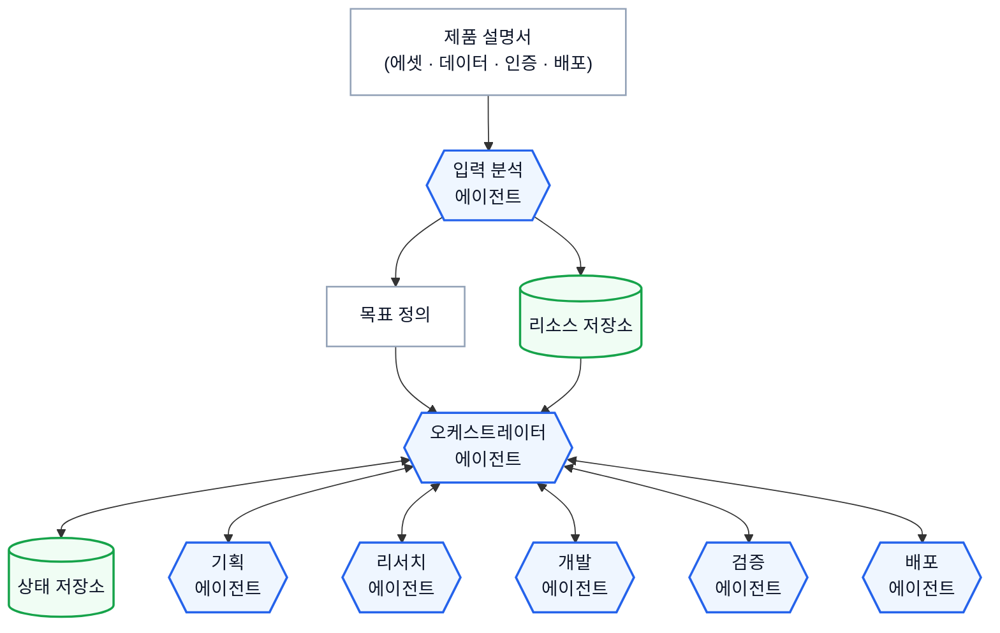
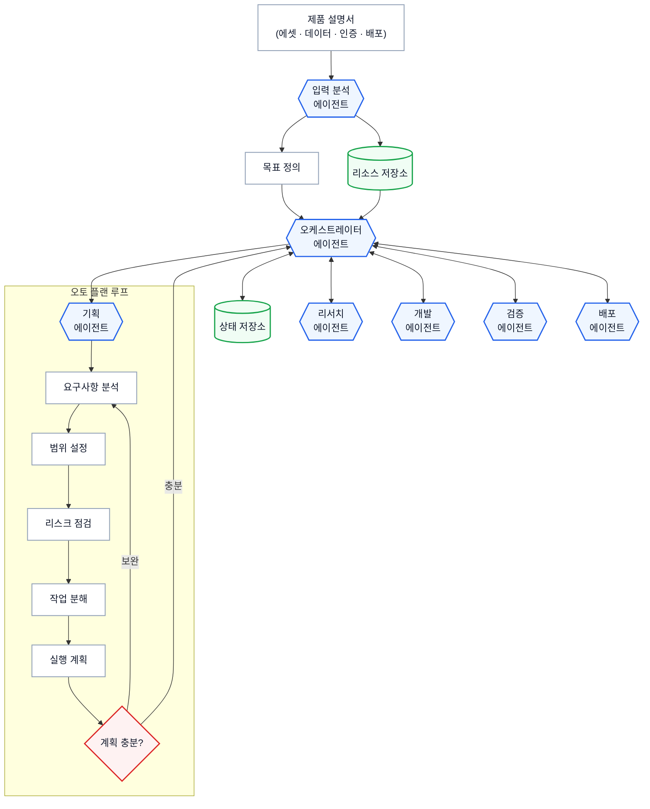
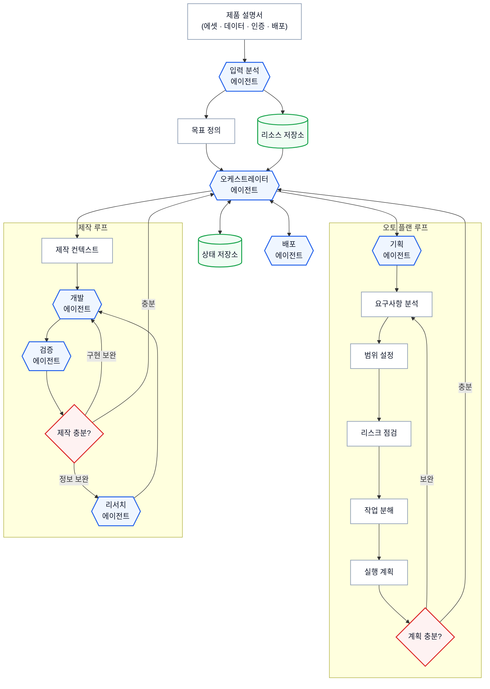
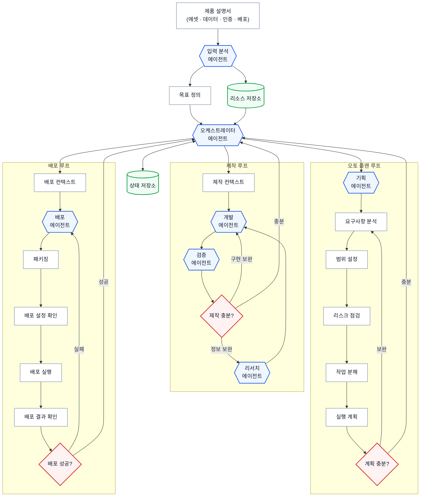
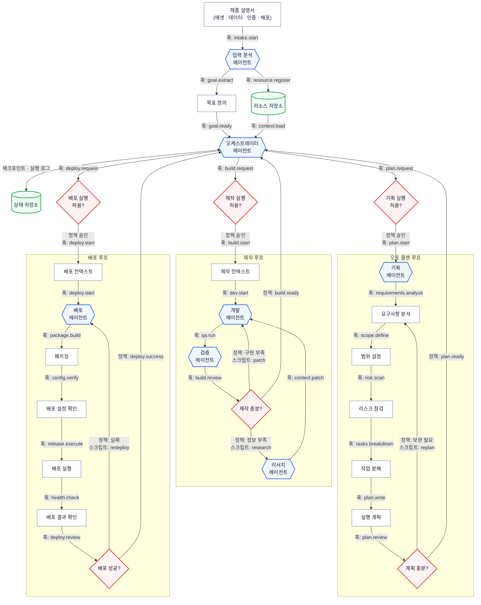

# Autonomous Product Engineering Harness 시연 시나리오

## 목표

이 시연의 목적은 **하네스를 한 번에 완성하는 것이 아니라, 에이전트가 점진적으로 하네스를 설계하고 확장하는 과정**을 보여주는 것이다.

각 단계는 다음과 같은 흐름을 따른다.

1. Agent CLI에서 프롬프트 입력
2. 에이전트가 하네스를 생성/수정하는 작업 수행
3. Harness Viewer 링크 생성
4. Viewer에서 그래프 확인
5. 다시 CLI로 돌아와 다음 기능을 추가

총 **5단계**를 거쳐 최종적으로 **Autonomous Product Engineering Harness**를 완성한다.

마지막에는 실제 하네스를 실행하여 제품이 완성되는 과정까지 시연한다.

---

# STEP 1. 하네스의 골격 생성

## CLI 프롬프트

```text
제품을 처음부터 끝까지 스스로 완성하는 자율 개발 하네스를 만들고 싶어.

입력으로는 제품 설명서와 함께 에셋, 데이터, 인증정보, 배포 설정이 담긴 폴더를 제공할 예정이야.

이번 1단계에서는 실제 개발이나 배포 로직을 구현하지 말고,
하네스가 자율 실행을 시작할 수 있는 상위 런타임 골격만 설계해줘.

반드시 포함할 구조는 다음과 같아.

- 제품 설명서를 읽는 입력 분석 에이전트
- 제품의 성공 조건을 정리하는 목표 정의
- 에셋, 데이터, 인증정보, 배포 설정을 등록하는 리소스 저장소
- 전체 실행을 조율하는 오케스트레이터 에이전트
- 실행 상태와 체크포인트를 기록하는 상태 저장소
- 이후 확장될 기획, 리서치, 개발, 검증, 배포 에이전트들
- 하네스 실행은 슬래시 명령어로 /harness로 할 수 있게 해줘

오케스트레이터 에이전트가 중심이 되어 하위 에이전트들을 조율하는 구조로 만들어줘.

각 하위 에이전트는 작업 결과를 오케스트레이터에게 보고할 수 있어야 해.
다만 이번 단계에서는 정책 게이트, 스킬, 훅, 스크립트, 반복 실행 조건은 만들지 말고,
나중에 확장 가능한 빈 슬롯으로만 남겨줘.

이 하네스는 OHAYO 라는 이름의 프로젝트 폴더를 만들고 그 안에 담아줘
하네스 생성이 끝나면 미리 만들어둔 Harness Viewer에서 확인할 수 있도록 링크 줘.
```

---

## Harness Viewer



---

# STEP 2. Auto Planning Graph 생성

## CLI 프롬프트

```text
이번에는 기획 에이전트를 오토 플랜 모드로 업그레이드해줘.

제품 설명서를 읽고 한 번에 계획을 끝내는 게 아니라,
스스로 목표를 정리하고 계획이 충분한지 검토하면서 보완하는 구조였으면 해.

기획 에이전트 안에는 다음 흐름이 들어가면 좋겠어.

- 목표 정리
- 요구사항 분석
- 범위 설정
- 리스크 점검
- 작업 분해
- 실행 계획 작성
- 계획이 충분한지 판단하는 루프

계획이 부족하면 스스로 다시 요구사항 분석으로 돌아가서 보완하고,
충분하면 오케스트레이터 에이전트에게 보고하도록 만들어줘.

완료되면 Harness Viewer 링크를 보여줘.
```


---

## Harness Viewer



---

# STEP 3. 제작 에이전트 클러스터 생성

## CLI 프롬프트

```text
이번에는 리서치, 개발, 검증 에이전트들을 묶어서 제작 루프를 만들어줘.

오케스트레이터 에이전트가 제작 컨텍스트를 개발 에이전트에게 주면,
검증 에이전트가 검증한 뒤, 개발 결과가 부족하면 다시 개발 에이전트가 보완하고,
정보가 부족하면 리서치 에이전트가 필요한 근거를 찾아 보강하게 해줘.

충분하다고 판단되면 오케스트레이터 에이전트에게 보고하도록 만들어줘.

완료되면 Harness Viewer 링크를 보여줘.
```


---

## Harness Viewer



---

# STEP 4. 배포 에이전트 생성

## CLI 프롬프트

```text
이번에는 배포 에이전트를 실제 배포까지 수행하는 구조로 업그레이드해줘.

검증이 끝난 결과를 바탕으로,
오케스트레이터 에이전트가 배포 컨텍스트를 만들고 배포 에이전트에게 전달하게 해줘.

배포 에이전트는 패키징, 배포 설정 확인, 배포 실행, 배포 결과 확인까지 처리하게 해줘.

배포에 실패하면 배포 에이전트가 다시 보완해서 재시도하고,
성공하면 오케스트레이터 에이전트에게 보고하도록 만들어줘.

이번 단계에서는 아직 정책 게이트, 훅, 스크립트, 모니터링은 넣지 말고,
배포 에이전트가 배포 흐름을 책임지는 구조까지만 보여줘.

완료되면 Harness Viewer 링크를 보여줘.
```

---

## Harness Viewer



------

# STEP 5. 프로덕션 하네스 완성

## CLI 프롬프트

```text
지금까지 만든 하네스 구조는 유지한 채,
각 연결선을 실제 실행 규칙이 있는 런타임 엣지로 바꿔줘.

오케스트레이터가 기획, 제작, 배포 루프를 실행할 때는
바로 실행하지 말고 각 루프 앞의 정책 게이트를 먼저 통과하게 해줘.

대부분의 연결선은 훅으로 강제 실행되게 만들고,
판단이 필요한 지점에는 정책 게이트를 붙여줘.

보완이나 재시도가 필요한 경우에는
어떤 스크립트가 실행되는지도 엣지에 표시해줘.

상태 저장소에는 체크포인트와 실행 로그가 기록되고,
리소스 저장소에서는 필요한 컨텍스트를 불러오는 구조로 만들어줘.

완료되면 Harness Viewer 링크를 보여줘.
```

---

## Harness Viewer



---

# 최종 시연 - 하네스 실행

```text
/harness 

방금 만든 하네스를 실행해서 OHAYO 서비스를 만들어줘.

OHAYO는 코디세이 동료들이 점심 같이 먹을 사람을 찾고, 맛집을 추천받고, 탁구나 간단한 게임도 같이 할 수 있는 커뮤니티 서비스야.

코디세이데이터 api, 필요한 자료, 데이터, 로그인 정보, 배포 정보는 ./ohayo-input 폴더에 넣어뒀어.

내가 원하는 건 다음이야.

- 구글 계정으로 로그인할 수 있어야 해
- 오늘 점심에 참여하면 사람들을 공정하게 그룹으로 묶어줘야 해
- 그룹에 맞는 맛집을 추천해줘야 해
- 사용자가 맛집을 검색하거나 제보할 수 있어야 해
- 탁구 상대를 찾거나 직접 도전할 수 있어야 해
- 오목, 오델로 같은 간단한 게임을 할 수 있어야 해
- 관리자는 점심 매칭, 맛집 제보, 사용자 상태를 관리할 수 있어야 해
- 휴대폰에서도 편하게 써야 해
- 테스트까지 하고 실제 배포까지 해줘

중간에 알아서 계획하고, 부족한 건 찾아보고,
만들고, 검증하고, 고치고, 배포까지 끝내줘.

완료되면 훅으로 자동으로 브라우저 창 띄워서 완성된 서비스 보여줘.
```
